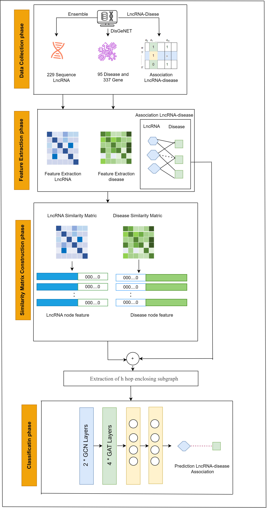

An Effective Deep Learning and Graph Neural Network Approach for Accurate Prediction of LncRNA-Disease Associations

In "Predicting LncRNA-Disease Association Using Gene Ontology and Deep Learning," a novel computational approach is proposed that integrates gene ontology with deep learning to predict associations between lncRNAs and diseases. The method extracts features from lncRNA sequences and disease gene interactions to construct similarity matrices and employs a graph neural network combining GCN and GAT layers. This approach achieves high predictive accuracy (e.g., AUC, AUPR) and provides valuable insights for identifying potential biomarkers and therapeutic targets.

pip install -r requirements.txt

# Python version: 3.8+
torch==2.5.1
torch-geometric==2.6.1
numpy>=1.21.0
scipy>=1.7.0
pandas>=1.3.0
matplotlib>=3.10.0
scikit-learn>=1.0.0
networkx>=2.6.0

